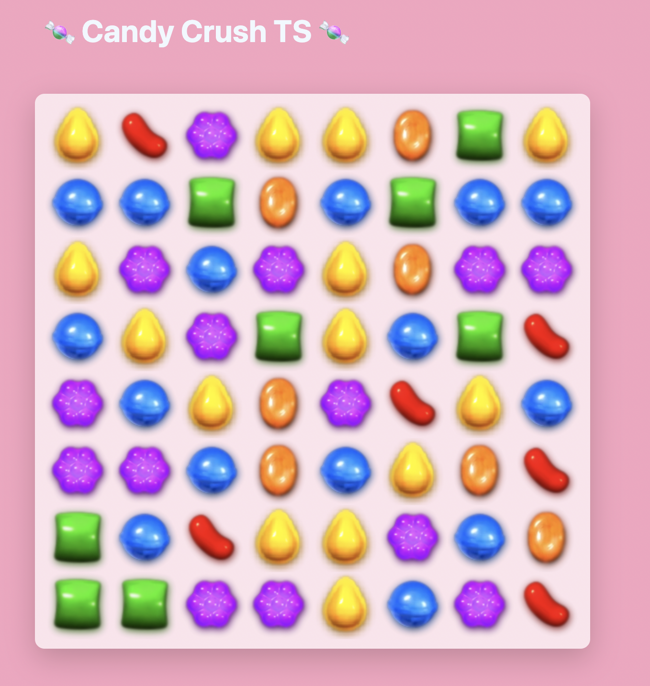

# 🍬 Candy Crush TS 🍬

A clone of the popular Match-3 puzzle game, built entirely from scratch using **React** and **TypeScript**. This project focuses on managing complex application states, handling Drag & Drop events, and implementing custom grid-scanning algorithms. Did it for TS trainee :)

## ✨ Features

I have implemented a fully functional game engine that handles:

* **Board Generation:** A dynamic 8x8 grid (64 elements) populated with randomized candies.
* **Drag & Drop Mechanics:** Utilization of the native HTML5 Drag and Drop API for element interaction.
* **Move Validation:** Logic restricting candy swaps to immediate neighbors only (up, down, left, right).
* **Match Scanning:** Algorithms continuously searching rows and columns for three-of-a-kind matches.
* **Gravity Logic:** Empty spaces created by matches are dynamically filled by elements falling from above, with new candies generated at the top row.
* **Live Scoreboard:** Real-time point tracking for every successful match.

## 🛠️ Tech Stack

* **React (Hooks):** `useState` for board state, scoring, and drag tracking; `useEffect` acting as the main game loop/engine, refreshing the board state every 100ms.
* **TypeScript:** Strong typing for state management, custom types (e.g., `CandyColor`), safe casting (`as`), and union types (`| null`) for robust error handling.
* **CSS:** `CSS Grid` for a responsive, perfectly aligned board, featuring advanced `Box Model` management and responsive padding.

## 🚀 Getting Started

1. Clone the repository
2. Install dependencies: `npm install`
3. Run the project: `npm start`

